# Pharma Catalyst Alert System — UML ábrák

Ez a dokumentum Mermaid szintaxisú UML ábrákkal mutatja be az alkalmazás pontos működését.
A Mermaid diagramok megjelennek a GitHub/GitLab webes nézetben, VS Code-ban (Mermaid Markdown
bővítménnyel) és a [mermaid.live](https://mermaid.live) oldalon.

---

## 1. Komponensdiagram — teljes architektúra

```mermaid
flowchart TB
    subgraph EX["🏢 Külső hivatalos források"]
        CT["ClinicalTrials.gov<br/>API v2 (studies)"]
        SEC["SEC EDGAR<br/>full-text search + Atom feed"]
        FR["Federal Register API<br/>FDA Notice of Meeting"]
        FDA["FDA Advisory Committee<br/>Calendar (HTML)"]
        YF["Yahoo Finance<br/>(yfinance, browser-UA)"]
        RSS["RSS feedek<br/>Fierce Biotech / Pharma,<br/>GlobeNewswire"]
    end

    subgraph RENDER["🚀 Render — egyetlen web service"]
        subgraph APP["FastAPI alkalmazás"]
            MID["Middleware<br/>api_key (legkülső) → rate_limit"]
            ROUTES["Route-ok<br/>dashboard · tickers · events · reactions"]
            CACHE["TTLCache<br/>dashboard 60s · stats 120s"]
            SCHED["APScheduler<br/>10 intervallum-job + 5 egyszeri + 2 cron"]
            SCRAPERS["Scraperek<br/>clinical_trials · pdufa · sec_filings<br/>news_feed · federal_register · fda_adcom"]
            SVC["Szolgáltatások<br/>price_service · reaction_service · notifier"]
        end
        DB[("PostgreSQL<br/>6 tábla")]
    end

    subgraph NOTIF["🔔 Értesítési csatornák"]
        DC_HI["Discord<br/>#high-impact-catalysts"]
        DC_SEC["Discord<br/>#sec-filings-live"]
        DC_CL["Discord<br/>#clinical-trials-updates"]
        DC_BR["Discord<br/>#daily-biotech-briefing"]
        DC_NEWS["Discord<br/>#news-feed"]
    end

    B["🌐 Böngésző<br/>dashboard.html (Tailwind + JS)"]

    B -->|"GET / , GET /api/*"| MID
    MID --> ROUTES
    ROUTES --> CACHE
    ROUTES --> DB
    SCHED --> SCRAPERS
    SCHED --> SVC
    SVC --> DB
    SCRAPERS --> CT
    SCRAPERS --> SEC
    SCRAPERS --> FR
    SCRAPERS --> FDA
    SVC -->|"fetch_price_and_change /<br/>get_historical_prices"| YF
    SCRAPERS --> RSS
    SVC -->|"POST embedek"| DC_HI
    SVC -->|"POST embedek"| DC_SEC
    SVC -->|"POST embedek"| DC_CL
    SVC -->|"POST embedek"| DC_BR
    SVC -->|"POST embedek"| DC_NEWS
```

**Működési elv:** minden adat *előre* gyűjtött — a dashboard soha nem hív élőben külső API-t.
A scraperek a hivatalos forrásokból töltik a `catalyst_events` táblát, az APScheduler 5 percenként
frissíti az árakat, a riasztásokat pedig a scheduler küldi Discord webhookokra. Minden esemény
`source_url`-lel és `verified=True` flaggel rendelkezik (kizárólag hivatalos források elve).

---

## 2. Osztálydiagram — adatmodell (SQLAlchemy ORM)

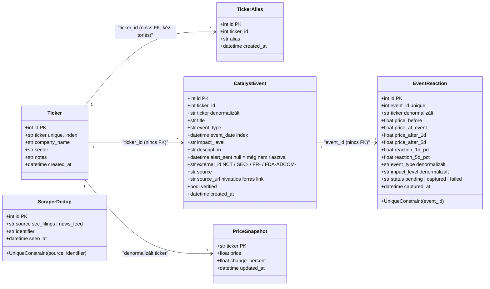

**Fontos tervezési döntések:**
- **Nincs FK megszorítás** — a kódbázis konvenciója szerint a kapcsolatok logikaiak, a törlés
  kézi kaszkád (lásd `delete_ticker`).
- **Denormalizáció** — `catalyst_events.ticker` és az `event_reactions` metaadatai (ticker,
  event_type, impact_level) azért duplikáltak, hogy az esemény pruning után is fennmaradjon a
  reakció-statisztika.
- **`ScraperDedup`** — a csak-értesítő scraperek (SEC feed, news) restart után sem küldenek
  újra régi tételeket; az in-memory `BoundedSet` csak gyorsítótár felette.
- **Uniqe megszorítások** — `(source, identifier)` és `event_id` — duplikátum-biztosítás.

---

## 3. Szekvenciadiagram — rendszerindítás (lifespan)

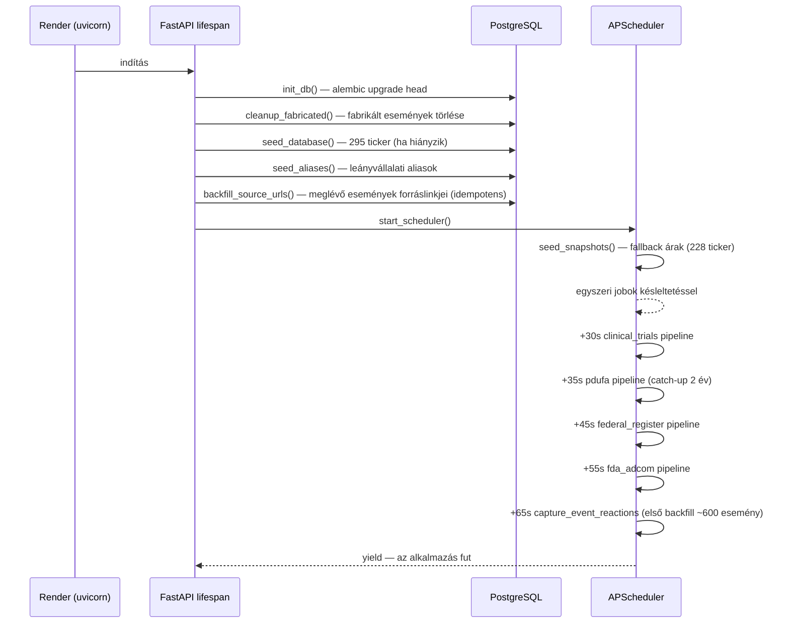

---

## 4. Szekvenciadiagram — dashboard lekérés

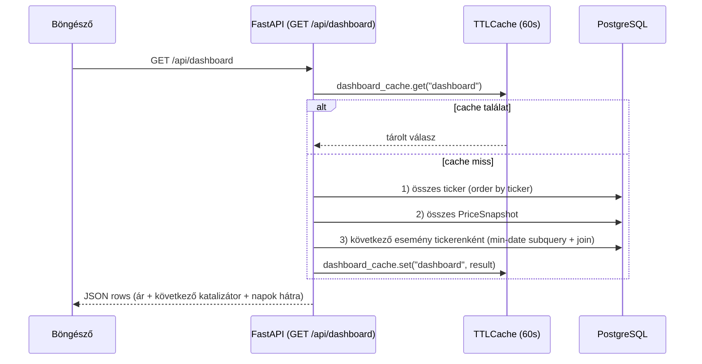

**Cache érvénytelenítés:** ticker/esemény CRUD, ár-frissítés és pruning mind `invalidate_all()`-t
hív — a dashboard ilyenkor legfeljebb 60 másodpercig mutat régi adatot. Nincs N+1 lekérdezés,
három bulk query az egész válasz.

---

## 5. Szekvenciadiagram — API védelem (middleware sorrend)

A Starlette-ben az **utoljára** regisztrált middleware a legkülső. Ezért: `api_key` fut először,
utána a `rate_limit` — a jogosulatlan kérések 401-et kapnak, mielőtt a közös per-IP bucket-be
számítanának.

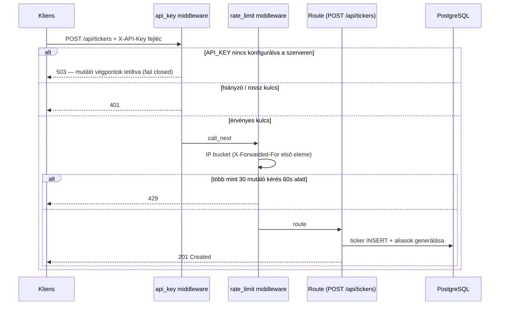

**Kivételek:** a GET végpontok publikusak (a dashboard linkkel bárki nézhető); a rate limit a
`/api/*` összes POST/DELETE kérésére vonatkozik.

---

## 6. Szekvenciadiagram — ár-frissítés (5 percenként)

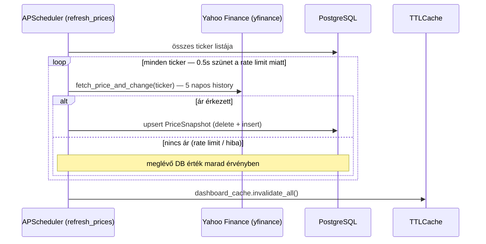

---

## 7. Szekvenciadiagram — riasztás küldése (6 óránként)

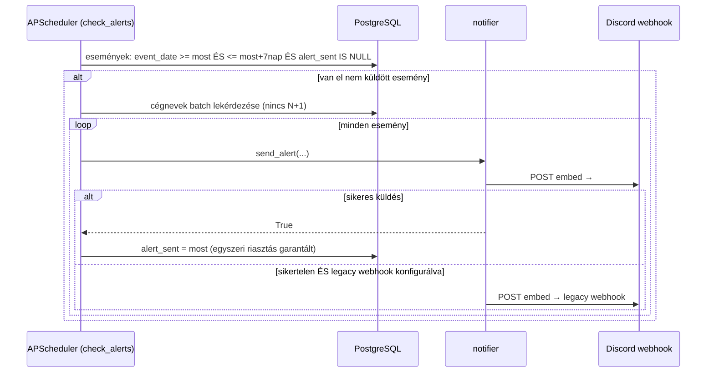

**Kulcsszabály:** minden esemény legfeljebb egyszer kap riasztást — az `alert_sent` timestamp
zárja le; a klinikai pipeline az UPDATE-nél ezt a mezőt megőrzi.

---

## 8. Szekvenciadiagram — klinikai trial pipeline (példa: esemény-felfedező scraper)

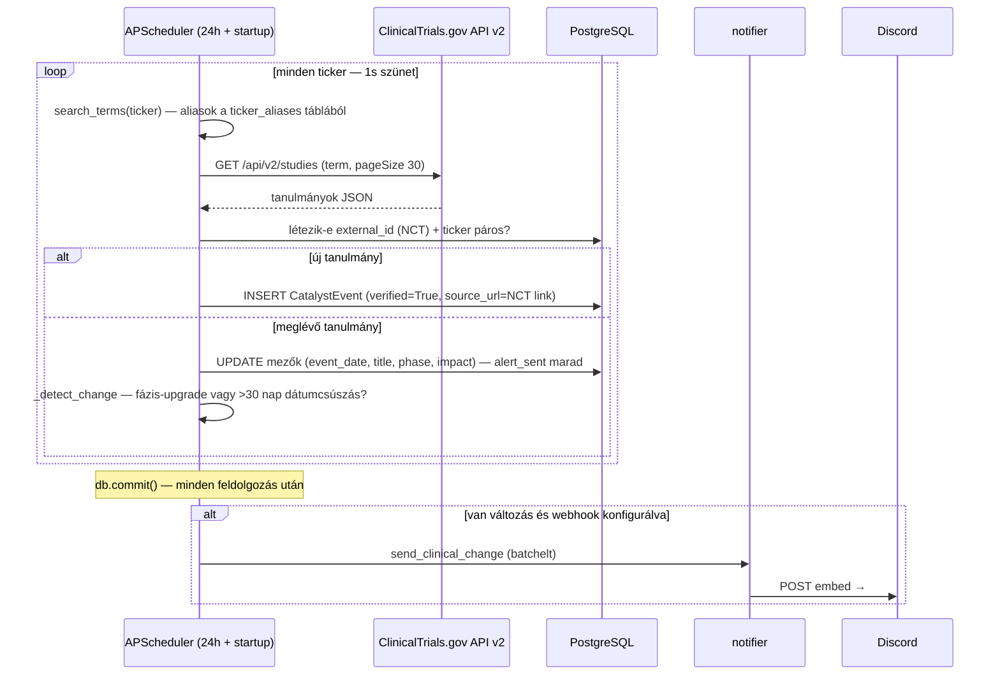

**Ugyanez az upsert minta** fut a PDUFA pipeline-ban (`external_id = SEC-{ticker}-{dátum}`),
a Federal Register pipeline-ban (`FR-{document_number}` + `(source, ticker, event_date)`
duplikátum-szűrés) és az FDA AdCom scraperben (`FDA-ADCOM-{ticker}-{dátum}`).
A SEC filings feed és a news feed **nem tárol eseményt** — csak Discord-ra küld,
`scraper_dedup` táblával deduplikálva.

---

## 9. Szekvenciadiagram — reakció-rögzítés (napi 1×)

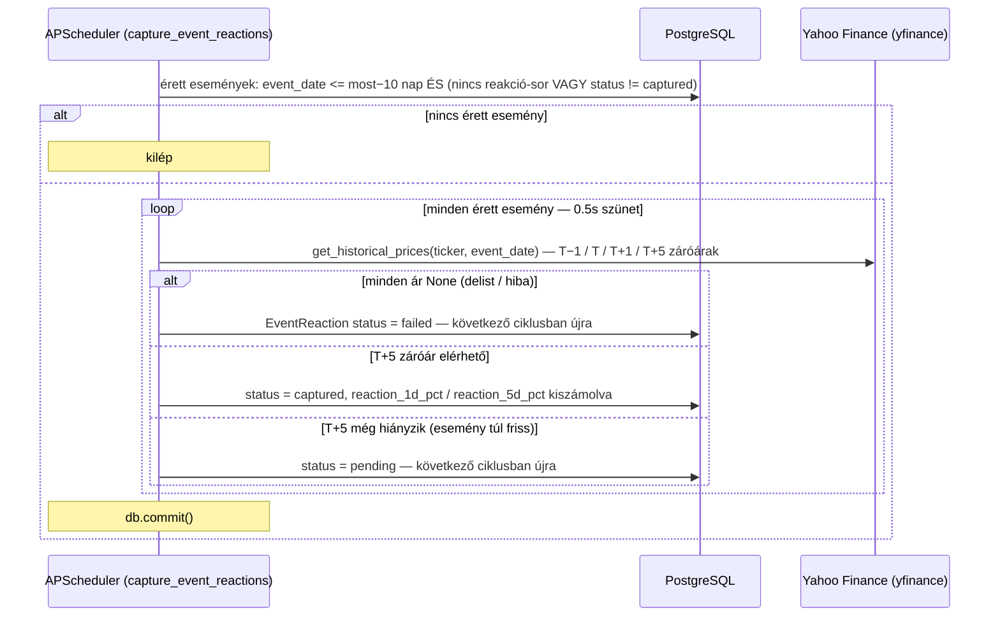

**A 10 napos küszöb** (`reaction_capture_min_days`) lefedi a T+5 kereskedési napot
(pénteki eseménynél ~7–9 naptári nap) plusz tartalékot.

---

## 10. Állapotdiagram — EventReaction életciklusa

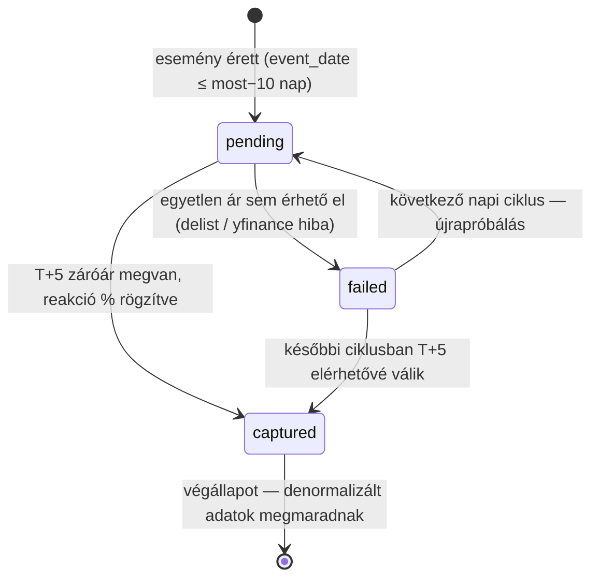

---

## 11. Állapotdiagram — CatalystEvent életciklusa

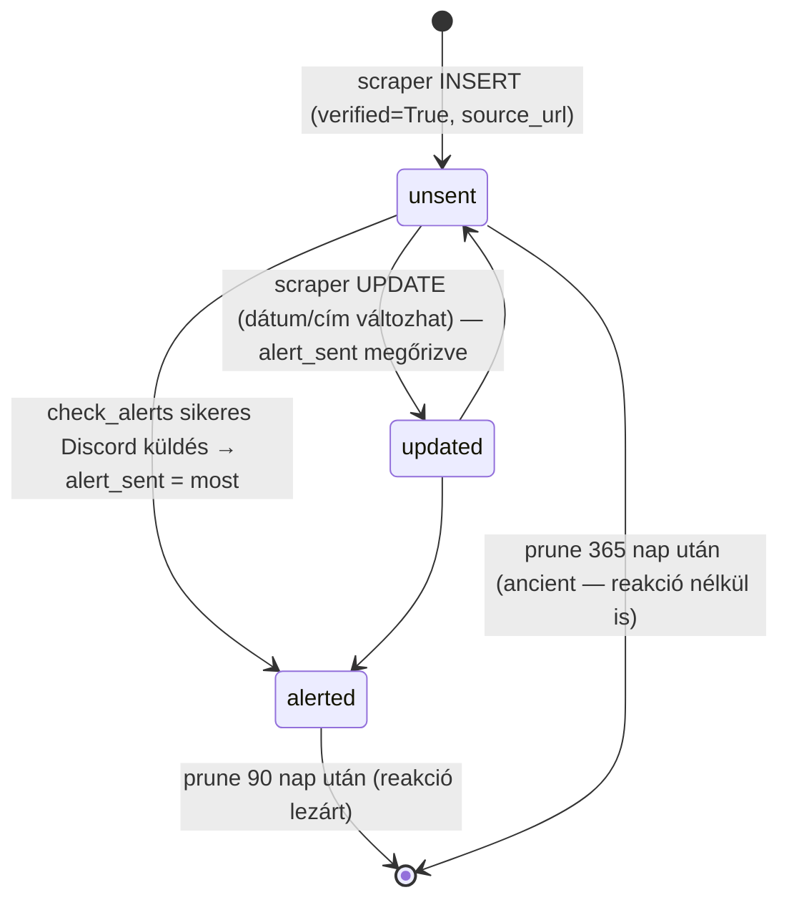

**Pruning szabály:** a 90 napnál régebbi esemény csak akkor törlődik, ha a reakció-sora
végleges (`captured` vagy `failed`); a 365 napnál régebbi mindenképp törlődik
(`prune_expired_events`, naponta).

---

## 12. Tevékenységábra — esemény-feldolgozó scraper általános folyamata

```mermaid
flowchart TD
    A([Scheduler indít]Job) --> B{Van konfigurálva<br/>a webhook / source?}
    B -- nem --> Z([Kilépés])
    B -- igen --> C[Forrás lekérése<br/>API / Atom feed / RSS / HTML]
    C --> D{Sikeres<br/>lekérés?}
    D -- nem --> E[log + hiba]
    E --> Z
    D -- igen --> F[Dedup ellenőrzés<br/>external_id / URL / (source, ticker, date)]
    F --> G{Már láttuk?}
    G -- igen --> H[UPDATE / skip]
    H --> I{Érdemi változás?<br/>fázis-upgrade, >30 nap csúszás}
    I -- nem --> Z
    I -- igen --> J[Discord értesítés küldése]
    G -- nem --> K[INSERT CatalystEvent<br/>source_url + verified=True]
    K --> L[Cache invalidation<br/>dashboard + stats]
    J --> Z
    L --> Z
```

---

## Melléklet A — Scheduler job-ok összefoglaló táblázata

| Job ID | Gyakoriság | Feladat |
|---|---|---|
| `refresh_prices` | 5 perc | yfinance árak → `price_snapshots` |
| `check_alerts` | 6 óra | küszöbön álló események riasztása (egyszer) |
| `clinical_trials_pipeline` | 24 óra (+ egyszer +30s) | CT.gov upsert, fázis/dátum változások |
| `pdufa_pipeline` | 60 perc (+ egyszer +35s) | SEC 8-K/6-K PDUFA dátumok (először 2 éves catch-up) |
| `sec_feed` | 30 perc | SEC filing feed → `#sec-filings-live` (csak értesítés) |
| `news_feed` | 60 perc | RSS cikkek → `#news-feed` (csak értesítés) |
| `federal_register_pipeline` | 12 óra (+ egyszer +45s) | FDA AdCom ülések a Federal Register-ből |
| `fda_adcom_pipeline` | 24 óra (+ egyszer +55s) | FDA kalendárium (jelenleg üres HTML — degradálódik) |
| `prune_events` | 24 óra | 90/365 napos esemény-törlés (reakció-védett) |
| `capture_event_reactions` | 24 óra (+ egyszer +65s) | érett események árfolyam-reakcióinak rögzítése |
| `morning_briefing` / `evening_briefing` | cron 08:30 / 21:00 (beállított időzóna) | napi összefoglaló (csak ha briefing webhook van) |

## Melléklet B — API végpontok

| Módszer | Útvonal | Auth | Leírás |
|---|---|---|---|
| GET | `/` | — | Dashboard HTML (Jinja2) |
| GET | `/health` | — | DB probe + scheduler állapot |
| GET | `/api/dashboard` | — | Tickerek + ár + következő esemény (60s cache) |
| GET | `/api/dashboard/stats` | — | Összesített számlálók (120s cache) |
| GET | `/api/tickers` | — | Ticker lista |
| POST | `/api/tickers` | API kulcs | Új ticker + alias generálás |
| DELETE | `/api/tickers/{ticker}` | API kulcs | Törlés kézi kaszkáddal |
| GET | `/api/events` | — | Események (ticker / upcoming szűrő) |
| GET | `/api/events/{id}` | — | Egy esemény részletei |
| POST | `/api/events` | API kulcs | Új esemény |
| DELETE | `/api/events/{id}` | API kulcs | Esemény törlése |
| GET | `/api/events/{id}/reaction` | — | Rögzített reakció egy eseményhez |
| GET | `/api/reactions/stats` | — | Reakció-statisztikák (szűrőkkel) |
| GET | `/api/reactions/stats/similar/{id}` | — | Kohorsz-statisztika (ticker+type → ticker → market) |
| POST | `/api/test-notify` | API kulcs | Teszt riasztás |
| GET | `/api/notify-status` | — | Konfigurált csatornák állapota |
